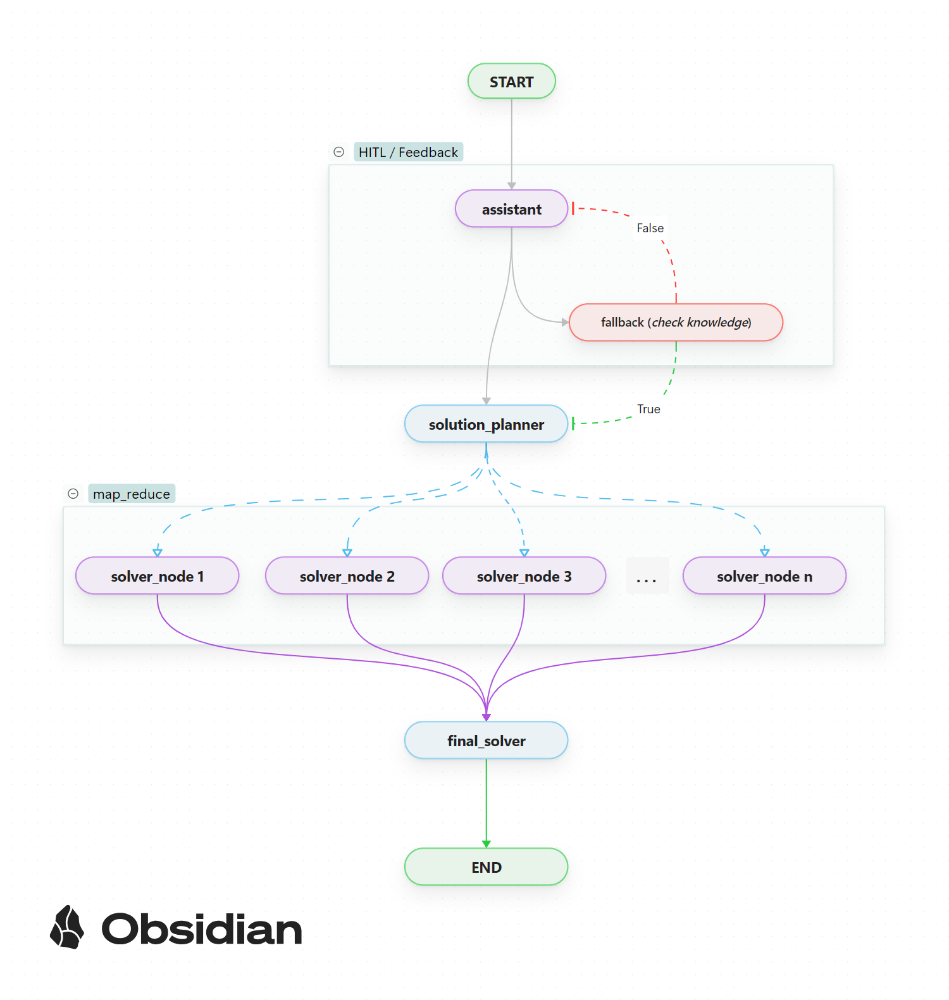

# Deceptive Reasoning — Improved Thinking for Non-Reasoning LLMs

A reasoning framework for non-reasoning language models with langgraph under the hood, to improve the reasoning and problem solving of non-reasoning / thinking models.


---
## Overview

This repository contains two LangGraph flows designed to improve factual accuracy and problem-solving of small LLMs.

**Highlights**

* \~70–80 % fewer initial factual hallucinations in models like Gemma-3
* Map-reduce flow splits problems into smaller parts for better optimization
* Human-in-the-Loop (HITL): asks the user to restate rather than hallucinate
* Modern state management, checkpoints and token-efficient prompting
* LangGraph Studio files included for visual editing

---

## Project Structure

```
deceptive-reasoning/
├── deceptive_reasoning_app/    # Files for the streamlit app (*gemini-2.0-flash-lite*)
├── notebooks/                  # Early version — linear chain, minimal state management
├── reasoning_v2/               # Modern version — HITL, map-reduce, checkpoints
└── studio/                     # LangGraph Studio files for both flows
```

* **v1** — simple linear LangGraph chain (no structured output, inefficient token usage)
* **v2** — full LangGraph features: HITL, map-reduce, checkpointers, clean state

---

## Installation & Usage

1. Clone the repository:

   ```bash
   git clone https://github.com/your-username/deceptive-reasoning.git
   cd deceptive-reasoning
   ```

2. Open LangGraph Studio:

   ```bash
   cd studio
   langgraph dev
   ```

3. Configure your model:
   Replace the sample model in the flow with your own (Gemma-3, Llama3, Qwen3 via Ollama).

4. Run and interact:
   The flow handles reasoning, HITL prompts, and reduced hallucinations.
5. (Optional) Chat:
   Switch to chat mode in the studio.

---

## Results

* \~70–80 % fewer factual hallucinations (vs baseline Gemma-3)
* More efficient token usage due to structured state & map-reduce
* Improved Reasoning and problem solving

---

## Contributing

Contributions welcome.
Please open an issue or PR for ideas, improvements, or bug reports.

---

## License

MIT License. 
